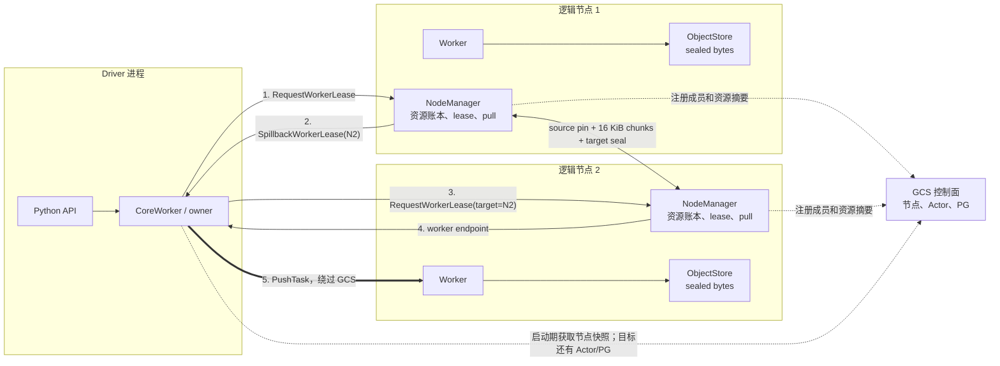

# mini-ray

> **2026-09-08：开发快照归档，非已验收发布。** 当前代码、历史证据和未验证草稿
> 已分开记录在 [交接状态](docs/handoff.md)。后续以
> [纠偏方案、语义差异与冻结交付表](docs/correction-plan.md)为待确认基线。
> 本次整理／推送不构成实施批准；K0/K1 未完成，仍等待明确语义确认。
> 本次未运行测试；旧 checkpoint 通过记录不能外推为当前快照通过。

mini-ray 是一个面向教学的、Python-only 的 Ray Core 最小实现。它参考
mini-SGLang 与 SGLang 的关系：保留生产系统最有辨识度的架构边界和语义，缩小
工程规模，最终让读者能从 Python API 一直追踪 worker lease、direct submission、
对象传输和故障恢复；当前接通范围以 [当前状态](docs/current-status.md) 为准。

它不是 `multiprocessing.Pool` 的薄封装，也不是生产 Ray 的 API 兼容替代品。项目
首先服务于理解分布式运行时，而不是吞吐、集群规模或生产部署。

## 学习入口

先读 [可执行学习路径](docs/learning-path.md)，再按下面七个原示例追踪同一个实际后端：

1. [Task 与 ObjectRef](examples/01_task_path.py)：异步提交、稳定身份与执行 trace。
2. [Lease 与 spillback](examples/02_spillback_direct_submission.py)：节点放置与 Worker 直达提交。
3. [跨节点对象 pull](examples/03_cross_node_object_pull.py)：逻辑引用、位置元数据与物理字节。
4. [Actor](examples/04_actor_control_direct.py)：控制面创建与直达方法调用。
5. [嵌套 get 与 CPU yield](examples/05_nested_get_cpu_yield.py)：阻塞时的资源转换。
6. [Lineage 重建](examples/06_lineage_reconstruction.py)：值恢复、稳定 Task/Object ID 与实际 attempt 0→1。
7. [Placement Group](examples/07_placement_group.py)：已提交 bundle 映射、实际执行与硬约束的边界。

安装见 [安装与测试状态](#安装与测试状态)。运行前先读 [测试安全策略](docs/testing.md)，
使用学习路径里的精确 bounded-runner 入口，每次只运行一个已审查示例；不要运行全默认测试。
第一遍掌握七条执行链，第二遍再读学习路径的 3A–3D 发布、custody 与恢复协议。
这只是阅读顺序，不省略现有协议保证，也不启用另一个教学后端。
例 1 的真实黄金 trace 直接展开 GCS INTENT/ARM/terminal/adopted，并区分
Node 释放资源、owner READY 与回复载荷托管退休；不会把 GCS 发布依赖隐藏在
“direct submission”之后，也不把退休 ACK 当作对象物理 GC。
例 2、3 之后可选读 [2A：局部性首跳实验](docs/learning-path.md#2a-optional-locality-chooses-the-first-lease-hop)，
区分“先向数据所在 Node 请求 lease”和“由 Node 最终决定放置”。

> **项目状态：v0.1 实现中；K0/K1 均未宣称完成。**
> 普通 Task 成功已接入统一 selected-output 发布；接线与历史单项通过都不等于完整 gate。
> 已定位的真实缺陷、冻结保证内的指定验证和职责整理仍待收口；
> 不以滚动白名单、历史测试全迁移或无限故障组合定义完成。
> 完整成功发布/收尾仍依赖同步 GCS INTENT/ARM 与 terminal/adopted 报告；
> 这是 mini-specific 协议，不是 Ray 的原样成功路径。
> 当前交接边界见 [交接状态](docs/handoff.md)，历史证据见 [checkpoint 记录](docs/current-status.md)；
> 原 [路线图](docs/roadmap.md)保留作来源，后续语义取舍仍待确认；
> 此前的故障增量记录保留在文末 [实现进展摘要](#实现进展摘要)。

## 目标范围

K0 建立一条真实、可观察的纵向路径：

- `Task`、`Actor`、`ObjectRef` 三个用户抽象；
- 使用 `spawn` 的真实多进程运行时，在一台机器上启动两个逻辑节点；
- GCS、NodeManager、CoreWorker、Worker、ObjectStore 的明确职责边界；
- 资源向量、feasible/available 区分和简化 Hybrid Scheduling；
- `RequestWorkerLease → spillback → GrantLease → PushTask`，其中普通任务在
  lease 成功后由提交者直接发送给执行 Worker；
- 未就绪 `ObjectRef` 依赖、不可变 sealed object、跨节点 pull，以及由 owner
  持有的位置元数据；
- `TaskID` 与 `AttemptID` 分离，结果 `ObjectID` 在重试时保持稳定；
- Actor 创建走 GCS，Actor 方法在创建完成后由调用者直达固定 Worker；
- 结构化 trace，使跨进程事件、进程内状态转换和跨 RPC 因果边可以被检查。

K1 在 K0 的同一身份模型和消息协议上加入：

- 分布式引用计数、borrower token 与 nested `ObjectRef`；
- task lineage、对象丢失后的 reconstruction、旧 attempt fencing；
- worker 内阻塞 `get` 时只临时让出 CPU，避免单 CPU 嵌套任务死锁；
- Placement Group 的 bundle 规划及 `prepare/commit/abort` 原子可见协议；
- 节点故障检测、资源与对象位置清理、受预算约束的任务恢复；
- Actor `generation`、重启状态机和旧 generation 消息 fencing。

当前能力与证据以 [唯一状态页](docs/current-status.md) 为准；完整阶段和验收条件见
[路线图](docs/roadmap.md)，逐项实现／证据／缺口见[验收矩阵](docs/acceptance-matrix.md)。按纵向执行链学习时，从
[可执行学习路径](docs/learning-path.md) 和七个递进示例开始。

## K0＋K1 目标架构

下图展示普通 Task 的放置和对象传输；图中的 GCS 节点注册/发现、两节点 lease
spillback、CoreWorker→远端 Worker direct `PushTask` 和节点间对象 pull 已接通。
成功发布、Actor 与 PG 路径未在图中展开。初始 GCS 节点查询发生在启动期；后续
lease 决策读取 NodeManager 已安装的不可变本地快照。



目标架构有三条重要边界：GCS 管控制面，但不逐个调度普通任务；NodeManager 分配
本地资源和 Worker lease；跨节点大对象字节由节点传输，不由 GCS 或 Driver 中转。
三条边界已进入当前两节点 store-backed 依赖路径：lease 和 `PushTask` 不携带该对象
payload，只携带 `RefArg`/`StoredArg` 与 descriptor；跨节点副本 bytes 由 NodeManager
之间分块传输。**GCS 不作普通 Task 放置，不等于它不在当前成功发布路径上**：所有
普通 Task 成功结果都同步等待 GCS INTENT/ARM ACK；Core adoption 还同步报告 terminal、
按需提交 contained graph，并报告 adopted。Node 本地 Complete 及 lease 释放不等待
terminal ACK，但完整发布/收尾仍依赖这些控制 RPC。GCS 只保存 manifest、digest 和
graph facts，不保存结果 bytes。这套显式发布协议是 mini 的教学设计，不是 Ray 原样实现。
Node 丢失时按槽判断保留或丢失：已收到的 INLINE bytes 可以保留，丢失的 STORED 槽
不能凭 metadata 还原。已adopted的STORED槽若有正常grant/location协议确认的
secondary，可以保留引用生命周期并改用当前存活副本，不重跑producer；KEEP后
副本又丢失则保持LOST和待退役membership，不能恢复决策时旧位置。
已知成功但丢失的槽由显式 `get` 请求重建；Complete 未知则在
精确清理后走预算内系统重试。重建与最后引用 GC 还须等待旧逻辑任务 finalizer 收尾。

Worker 内的 Core 也需要这份死亡事实：Driver 取得 GCS death record、收齐所有 survivor
的同一 snapshot 安装 ACK 后，将累计 `InstalledNodeDeathView` 保留在存活 Node。内嵌 Core
在懒创建及既有 coordinator 轮询时，从自己的 Node 读取并消费它。它不是新的故障检测器，
不把 Worker death、timeout 或快照缺席推断成 Node death，也不接管已死 owner。
这条传播路径不新增逐 Task 的 GCS 死亡查询；普通成功原有的同步 GCS 发布依赖仍保留。

普通 Task 的新 lease 还有一个独立的首跳提示：
[`lease_policy.py`](src/miniray/lease_policy.py) 按每 Node 持有的去重 stored 依赖字节数评分，
同分先选 home，再按 NodeID。Core 只使用匹配当前 epoch 的本 owner canonical 对象位置；
foreign 依赖只用原 descriptor 给出的一个 source，不为评分查询其完整副本表。
它不筛 total/available，也不分配资源；首跳即使缺所需资源，仍由 Node 的 Hybrid/账本
裁决，允许从数据 Node spillback 回 home。首跳的 `preferred_node_id` 指向实际收件 Node，
requester 身份不变，`target_node_id=None`；PG 与已冻结的协议重放不重新评分。
Driver 使用已安装快照；无完整快照的 Worker 可用成功地址缓存，冷查询失败只回退 home，
不推断 Node 死亡或新增强制 GCS 查询前提。实现与限定实验入口见学习路径 2A；这不改变
同步 GCS 发布、global fail-fast DAG 或 phase-specific 恢复合同，也不代表完整 Ray 还原。

## 当前公开 API

`remote/init/get/put/wait/shutdown`、RemoteFunction 和 ActorClass/ActorHandle 已进入公开
API；Driver 还可用 `trace()` 查看 collector 快照，用 `export_trace(path)` 将当前快照
确定性地导出为 JSONL，原子替换目标文件。导出不等于跨进程 trace 已全部收齐。
普通 Task 与 Actor 的一节点、两节点运行时有历史独立
multiprocess smoke 记录；当前 `init()` 接受 `num_nodes=1` 或 `num_nodes=2`，并以
`num_workers_per_node=1|2` 选择每节点一个或两个固定普通 Worker；任务可用
`num_cpus` 和 `resources` 声明资源。下面代码展示已验收的单节点最小 API；两节点
smoke 还验证了自定义资源强制选择第二个节点、store-backed 依赖跨节点消费，以及
Counter Actor 的持久状态与串行调用。独立 smoke 分别验证同一存活 Node 内的 Actor
Worker generation restart 和 Actor 所在 Node 死亡后迁移到 survivor；这些代表切片仍不
等于完整 K0/K1：

```python
import miniray as ray

ray.init(num_nodes=1)

@ray.remote
def add(x, y):
    return x + y

ref = add.remote(1, 2)
assert ray.get(ref) == 3
ray.shutdown()
```

包名使用 `miniray`，示例里别名为 `ray` 只是为了便于对照；项目不承诺可以把
生产 Ray 直接替换为 mini-ray。两个逻辑节点、lease spillback 和跨节点依赖 pull 已
实现；普通 Worker 执行线程也可通过绑定的内嵌 Core 调用 `remote/get` 提交并取得子任务
的普通值。Worker-owned inline ObjectRef 现在可以逃逸到 Driver，并由 borrower 通过 owner
endpoint 读取；foreign stored ref 由 owner 返回无字节 descriptor、borrower 直取 Node；
Driver-owned ObjectRef 也可作为容器内 nested Task argument 传入 Worker：逻辑 Task
hold 由完整的 `(kind, submitting_worker_id, task_id, origin_attempt_id)` 绑定，跨排队和
SYSTEM retry 保持同一 incarnation；物理 attempt 在 owner ACK 后取得 borrower 并在完成前释放；
nested handle 不进入 readiness gate 或 Node pull。
blocking-get CPU yield 已接通 Worker notifier 和单 CPU、双 Worker 的端到端路径。foreign
INLINE 与跨节点 stored Task dependency 已使用独立 retained hold 接通；stored physical
GC 已覆盖 source/target replica 删除及 metadata、descriptor、waiter、obligation、lineage
收敛。普通 Worker 的单进程 crash detection、fresh replacement 和预算内 retry 已有
窄纵切片；foreign-input lineage 与 multi-return partial-loss 已分别接通 bounded 纵切片。
普通 Task 的所有成功 selected returns 现在先经 `OutputDiscoverySession`：每槽
序列化一次，按槽选择 INLINE/STORED，并保留原始 return index。真实 `StartLease`
ACK 提供已注册 Node incarnation；一张 `_PreparedOutputReply` 保留 bytes、源 handles
和 argument import transaction，再调用 `PrepareOutputPublication`。Node 的统一
journal/adapter 驱动 INTENT、child prepare、单次 graph reservation、逐槽物化、
promotion 和 ARM；本地 Complete 返回权威 envelope，Core 以一次 owner batch CAS
发布 selected set，再完成 adoption。未知 ACK 只重放保留的记录，不重跑用户代码；
source/import release 与失败补偿也必须精确收敛。
当存活的提交者 Worker 自己执行重试时，executor 与 output owner 可以是同一 WorkerID。
此时 provisional token 使用 `provisional:<final-token>`，final token 及序列化引用不变，
使临时 custody 和最终 outer lifetime 仍是两个不同 hold；不同 owner 的原 token 规则不变。
这不新增 wire 字段、owner 或发布后端。
Worker物化顶层Task依赖时，结果bytes中的contained ObjectRef也进入同一attempt
import session；显式nested参数使用TaskHold，物化结果的子引用仍使用原contained
hold，不相互冒充。重复参数去重、后续decode失败逆序回滚、返还child时保留到
promotion ACK；普通无引用值不因这条路径额外要求embedded Core。

这条路径已包含 multi-return contained 和 targeted-contained；一个 child 出现在
不同 output 槽时拥有独立 contained hold。GC 逐槽释放 child、graph 和 replica，最后
一个 sibling 才释放 task lineage。Targeted reconstruction 仍执行整个函数，只替换
选定的 LOST 槽，不改健康 sibling。新增
[mixed-contained 测试](tests/integration/test_multi_contained_output_path.py) 与
[mixed Node-loss 测试](tests/integration/test_multi_output_node_loss_path.py) 覆盖这些预期，
但文件存在不等于本轮通过。Core/Node/GCS/owner 不再构造或选择旧 INLINE/STORED 发布后端；
旧生命周期模块、结果wire字段与InlineInstall facade均已退役。F4/F5 另验证 outer owner
分别在 INTENT 后和 promotions 后死亡：child owner 与 executor 仍活，原 holds、graph、
replica 和 executor custody 必须精确清理，迟到 Prepare 不能成功，Driver 不取得死 owner 的对象。
对应[pre-Complete owner-death 测试](tests/integration/test_precomplete_output_owner_death_path.py)
和[Worker-owner Node-loss 测试](tests/integration/test_worker_owner_node_loss_path.py)已有窄证据；
更宽组合、历史合同替代覆盖与同版本完整复验仍须完成。

## Same / Simplified / Omitted

| 分类 | K0＋K1 的边界 |
|---|---|
| **Same** | Task/Actor/ObjectRef 的核心语义；CoreWorker 先取得 NodeManager worker lease、再 direct submission；GCS、节点级资源真相和 owner-based object metadata 的职责分离；不可变对象；逻辑 ID 与物理 attempt/generation 分离；Actor 创建与调用的两条路径；PG 在全组成功前不可见 |
| **Simplified** | Python-only 与 `cloudpickle`；单机 loopback 上一至两个逻辑节点；单 GCS、fail-stop 模型；每 Node 预启动 1–2 个固定 ordinary Worker slot，每个 Task 使用一个 LeaseID，spillback 两跳保持该 LeaseID；生产 Ray 则由 raylet 按 job/language/runtime env 动态启动和复用 Worker，并可在一个 leased Worker 上发送多项排队工作；标量资源和确定性 Hybrid 策略；串行 Actor，Worker restart/Node-loss migration 重跑构造器但不重放旧调用；直接 borrower-owner 引用协议；PG 的 bounded backtracking 与 `STRICT_SPREAD` 增广路匹配；本地文件/内存 trace |
| **Omitted** | GCS HA/共识与持久恢复；真实多机运维和 Autoscaler；Dashboard、Jobs、runtime env、多语言；Plasma 零拷贝、对象 spilling、RDMA；抢占和生产级公平调度；Actor ObjectRef 参数、method-call 透明重试、named/detached lifetime、concurrency groups 与 PG Actor；PG bundle rescheduling（participant loss 仅终态 LOST）；安全隔离/TLS；Data、Train、Tune、Serve、RLlib 的完整实现 |

“Same”表示语义和消息顺序相同，不表示类名、线程模型、线协议或性能与生产 Ray
逐行一致。详细说明见 [设计文档](docs/design.md)。
预启动 Worker 进程可连续执行任务，但每个新任务 attempt 仍取得自己的 LeaseID；
warm Worker 或函数缓存不等于生产 Ray 在同一个 leased Worker 上复用 lease、排队和流水执行。

## 当前代码布局

v0.1 当前采用平铺模块，职责边界已经显式写入代码：

```text
src/miniray/
  __init__.py        # 公开包出口和版本
  api.py             # remote/init/get/wait/shutdown、ActorClass/ActorHandle
  core.py            # Driver CoreWorker、依赖协调、两条 dispatch lane 与 direct submission
  control.py         # GCS 节点/资源、Actor 创建/重启与 PG 两阶段协调
  node.py            # Hybrid spillback、资源账本、Worker lease 状态与释放权威
  worker.py          # StartLease、执行/结果缓存或 seal、CompleteLease
  protocol.py        # 不可变 TaskSpec、参数和 RPC 消息
  node_death_view.py # Driver收齐survivor安装ACK后的累计证明；Node保留、Worker Core读取
  transport.py       # 有帧上限的 loopback TCP request/reply
  ids.py             # 逻辑 ID、attempt 和 generation
  resources.py       # 精确资源向量、账本和 Hybrid policy
  dependency.py      # 顶层依赖与 nested ObjectRef 编解码/解析
  runtime_binding.py # Driver/Worker 当前线程的 Core 与 parent attempt 绑定
  object_store.py    # 有容量上限的 create/write/seal/pin 对象存储
  ownership.py       # owner 元数据、引用 token、位置和 attempt fencing
  contained_cycle.py # 单次 selected-output contained DAG reservation
  output_discovery.py         # 每槽一次序列化与 source custody
  output_publication.py       # 统一 manifest、Complete witness 与 envelope
  output_publication_journal.py # Node intent/ACK、Complete 与逐槽退役
  output_publication_node.py  # child/graph/物化/ARM effects 与 terminal outbox
  output_protocol.py         # Worker/Node/Core/GCS 的统一发布 RPC
  output_recovery.py         # metadata-only GCS 恢复权威
  publication_sources.py    # storage-tier 无关的 source capability 与 Node incarnation
  stored_publication.py      # 仅历史pickle同类型导出，无旧生命周期实现
  object_manager.py  # 位置选择、合并 pull、分块校验和目标 seal
  lease_dependencies.py # Node请求级副本库存与精确custody ACK，不管理执行/删除
  transfer_pins.py   # 远端source pin的active读者期、close ticket与Release重放
  replica_cleanup.py # 被拒绝的迟到副本之exact物理删除义务，不接管逻辑GC
  placement.py       # PG 规划与 prepare/commit/abort 纯状态机
  recovery.py        # retry、lineage reconstruction 与 attempt fencing
  actor_state.py     # Actor 串行 mailbox、去重、FIFO 与 generation fencing
  actor_client.py    # owner 侧 Actor route cell、route epoch 与 in-flight call fencing
  trace.py           # 内存/JSONL 与异步远端结构化 trace sink
  trace_collector.py # Driver 持有的跨进程事件汇聚器
  debug.py           # snapshot/trace 查询；failpoint 与正确性路径隔离
  errors.py          # 公共错误类型
```

已实现且有历史 Gate A 证据的纯算法/状态模型包括：

- 强类型 ID、稳定 `TaskID/ObjectID` 与递增 attempt/generation；
- 定点资源算术、幂等 allocation token、feasible/available 判定、GPU 避让与
  seeded top-k Hybrid 选择；
- 不可变对象的 `create → write → seal`、pin token、owner 引用 token、位置更新与
  旧 attempt fencing；
- 顶层依赖 gate、nested ref 保留、确定性对象位置选择、并发 pull 合并、分块校验和
  完整 seal；
- PACK/SPREAD/STRICT_PACK/STRICT_SPREAD 规划，以及幂等
  `prepare/commit/abort` 和回滚；
- application/system failure 分类、重试预算、lineage reconstruction 合并与旧
  attempt completion fencing；
- Actor mailbox 的 per-caller FIFO、重复调用缓存和 generation fencing。

此外，CoreWorker 已与 owner table 接通：提交时注册逻辑对象和引用 token，完成时先
发布 inline/stored/error 权威状态再唤醒等待者，并拒绝旧 attempt 的迟到结果。单节点
大对象路径也已接入真实运行时：Worker 将大结果 seal 到 Node 所拥有的 ObjectStore，
Task reply 只返回 descriptor，owner 发布位置后由 `ray.get()` 从 Node 取回并校验字节。
两节点路径会启动独立 GCS 和两个 Node/Worker；Node 注册地址与资源摘要，首节点的
Hybrid policy 可返回 spillback，提交者随后向目标节点取得 lease 并直接向远端 Worker
发送 `PushTask`。Worker 在执行前向实际签发节点确认 `StartLease`；所有成功结果
都先完成统一 publication prepare，再由 Node 在 `CompleteLease` 时返回权威 envelope。
NodeManager 本地推进 journal/lease 终态并释放资源；Worker 排空 source/import custody
后缓存成功 `TaskReply`。STORED 槽只返回 descriptor，INLINE 槽在 envelope 中携带 bytes。
CoreWorker 不因 RPC 超时或连接结果不明而释放运行中 lease；
Worker 异常时，Node 仅在确认进程退出后回收。基础 lease 路径有历史 Gate A
integration-style 单元和 multiprocess 证据；统一发布增量不能直接沿用旧通过记录。
`RequestWorkerLease` 的回复若持续不明，Core 会先重放相同请求，再发送同身份的
`CancelWorkerLease`；Node 将 cancel 与 grant 串行化，并以 tombstone 阻止迟到 grant。
只有收到 accepted/cancelled ACK 后，Core 才把该不明 lease 转为终态错误。
lease 已明确 grant 后，`PushTask` 采用更严格的规则：只有第一次连接 Worker 就得到
`TransportConnectionError`，才能证明请求字节尚未到达 Worker，此时 Core 才可以释放或
取消该未启动 lease。`RemoteCallError` 也属于执行结果不明，因为 Worker 可能已经执行并
缓存结果，只是在完成 lease 或返回 reply 时失败；发送/接收错误同理。进入不明状态后，
Core 只会向同一 Worker 重放完全相同的 `PushTask` 和 LeaseID，不申请新 lease，也不因
后续连接失败释放旧 lease。Worker 以 attempt＋lease 缓存结果，要求重放请求完全相等，
并重放尚未收敛的 prepare/Complete 与本地清理，而不重复执行用户函数。
Worker 一旦接受某个 PushTask，就对该精确请求承担恢复义务：即使 shutdown 已关闭新任务
准入，完全相同的 attempt＋lease＋PushTask 重放仍可读取缓存并补发 `CompleteLease`；改变
内容的重放仍被拒绝。clean shutdown 必须等待已接受任务形成缓存且完成 ACK 收敛，不能把
“停止接收新任务”误当成“已接受任务已完成”。Core 对不明 Push 或 cancel 也保持显式
unresolved 状态：短 shutdown 只返回 `False`，保留 owner `PENDING`、submitted tokens、
coordinator/dispatch lanes、reference thread 和 trace sink。协议凭有效 TaskReply、正向 release
或 accepted cancel 收敛后，第二次 shutdown 才完成终结与清理。
Driver CoreWorker 已把提交准入、依赖等待和执行拆开：未就绪依赖停留在 coordinator，
不占 dispatch lane；两节点运行时使用两条 lane，使两个资源固定到不同节点的 ready
Task 可以真实重叠执行。`PENDING_CAPACITY` 不阻塞 lane，而是进入有界延迟队列，保持
TaskID/AttemptID/LeaseID，以 $O(1)$ 瞬时 Node 重评重排，避免为瞬时容量波动制造新的
lease 身份。普通 Worker 会为当前 job 懒创建一个 CoreWorker，
通过 thread-local runtime binding 将公共 `remote/get` 路由到它；child Task 仍请求普通
lease 并 direct `PushTask`。child ID 由 parent TaskID、parent AttemptID 和提交序号派生，
而 `TaskSpec.parent_task_id` 保留逻辑 parent。当前 smoke 的 parent 显式请求 0 CPU，且只
把普通值返回 Driver；另一个 smoke 已验收 Worker-owned inline ref 逃逸与重复 outer `get()`。
owner endpoint 是路由位置，WorkerID 才是稳定 owner 身份；结果序列化先无副作用地
发现引用并保留源 handle，再由 publication 协议安装 durable contained hold。接收方生成
唯一 borrower token 并同步取得 owner `Acquire` ACK 后才暴露
ObjectRef。Release 使用同一 borrower/transfer 身份并留下 tombstone，避免迟到 Acquire 复活。

跨节点依赖路径也已接入运行时：未就绪 `ObjectRef` 可先提交而不在 Driver 隐式
`get()`；依赖 ready 后，目标 Node 在签发 worker grant 前 pin 源副本，以固定
16 KiB chunk 拉取并校验 checksum，只在目标 ObjectStore 完整 seal 后返回 grant。
lease request/grant 和 `PushTask` 均不携带对象 bytes；后者保留 `RefArg` 及目标本地
descriptor，由 Worker 从本地 Node 物化参数。当前验收覆盖一个 64 KiB、两任务、
两节点的有界路径，不代表对象 spilling、并发大规模传输或完整分布式 GC。
并发相同对象的 pull 在目标 Node 串行合并；失败 pull 会清理临时状态并以新 epoch
重试。源 pin release 会重试，shutdown 还会 sweep 遗留 pin。owner locations 在成功
后同时包含源、目标副本；`GetObject` 以 attempt、owner、size、checksum fencing。
submitted-reference token 在任务入队时即建立，避免等待期间对象过早释放。

K0 Actor 路径也已接通：`@remote` class 创建请求经过 GCS；GCS 选择节点，由该 Node
持有 Actor lifetime resources 并启动专属 Worker。创建完成后，ActorHandle 方法调用
由 caller CoreWorker 直达专属 Worker，串行 mailbox 保证 caller FIFO，消息携带并
校验 generation。当前 Counter smoke 验证三次调用状态为 1/2/3、专属 PID 与普通
Worker 不同，以及 GCS＋2 Node＋2 普通 Worker＋1 Actor Worker 共 6 个 PID/端口清理。
Phase B1 还接通一个同 Node Actor Worker restart：Node 只以受管 Actor 子进程 sentinel
确认退出，释放旧 generation 的 lifetime token 并向 GCS 精确报告；GCS 先向 owner 发布
无 endpoint 的 `RESTARTING` route，再在相同存活 Node 上用 fresh WorkerID/PID 启动下一
generation，最后发布新的 `ALIVE` route。ActorID 保持稳定，generation 增加，旧 in-flight
方法得到 `ActorDiedError` 且不会在新构造器状态上透明重放；新实例从构造器初态开始。
同一 ALIVE route 在有界确认期内仍不可达时返回 typed `ActorUnavailableError`。独立的
Node-loss 路径还会保持 ActorID、递增 generation/route epoch，在 survivor Node 上以 fresh
Worker incarnation 重新执行构造器；旧 generation 调用失败且不透明重放。当前仍不实现
named/detached lifetime、方法重试或 PG Actor。PG planner、
GCS prepare/commit/abort、Node
child ledger 和 bundle-bound Task 已接入运行时；participant Node-loss 会终止为 LOST
并清理 survivor reservation；Actor PG 与 bundle rescheduling 仍未实现。
Actor shutdown 已加固为停止接收、drain 已接收 mailbox，再 fencing 新调用；Core 为
每个 Actor handle 维护调用 sequence，Worker 对相同 sequence replay 返回缓存结果，
冲突 replay 被拒绝。

Placement Group 公开面采用同步 `placement_group()`、bundle-bound Task options 与
`remove_placement_group()`。GCS 在 shadow view 上规划，向每个 participant Node 发
prepare/commit；只有全部 commit ACK 后才发布 immutable bundle key。Node prepare 只从
root ledger 聚合扣账一次，commit 建立 child ledgers，Task 只能从指定 child ledger 分配且
不得 spillback 或回退 root。remove 和集群 shutdown 先 fence 新 Task，再等 child lease
终结后释放 root；独立 GCS PG-drain barrier 在 Node endpoint 仍存活时收敛全部 abort。

公开 `put()` 由 Driver-side CoreWorker 直接创建 owner entry：小值 inline ready，大值
seal 到本地 Node ObjectStore 后发布 location；它不申请 Worker、不产生 producer
TaskSpec，因此物理副本丢失后不可通过 lineage 重建。`wait/get` 对两种结果使用与任务
输出相同的 ObjectRef 语义。

普通 task 的 by-value 参数共享同一累计 inline budget（按 positional、再按 keyword
插入顺序）。参数只序列化一次；累计超过 `inline_threshold` 时，同一 payload 先 seal
为内部 put 对象，`TaskSpec`、lease 和 `PushTask` 只携带 `StoredArg`/descriptor。
`StoredArg` 保留 serializer 与 nested-reference manifest，所以 Node 仍只拉对象 bytes，
Worker 再通过 attempt-wide import transaction 恢复嵌套 handle；nested refs 不会误变成
调度依赖。submitted 与 lineage hold 接管后立即释放内部临时 handle，失败路径则完整
回滚并进入对象 GC。教学实现把 Ray 的单参数阈值和 task RPC 总预算合并成一个配置。
含 nested ObjectRef 的 `StoredArg` 增量已有实现、定向单元测试和独立 nested-large
参数 smoke；当前增量仍待完整 unit gate 复验。既有的大结果或跨节点 pull smoke
不能代替该项证据。

普通 Task 支持显式 `max_retries`。Worker 返回 `SYSTEM_ERROR` 时，Core 在预算内用新
AttemptID 和新 lease 重提，但保持 TaskID/ObjectID 稳定，并用 failpoint 确定性验收
attempt 0 失败、attempt 1 成功。application error 默认终止，不消耗系统 retry 预算。

## 安装与测试状态

项目要求 Python 3.9 或更高版本，运行时依赖只有 `cloudpickle`；`pytest` 是可选的
测试依赖：

```bash
python -m pip install -e '.[test]'
```

可编辑安装入口已经存在，但安装成功本身不构成功能完成声明。本机测试必须遵守
[测试安全策略](docs/testing.md)：项目的 pytest 默认配置已经限制为 `-m unit`；
MacBook Air M4 16 GB 默认只运行纯单元测试；
多进程 smoke test 必须先静态确认规模，再逐个串行运行；重型或规模不明的测试
不得在本机运行。

已审查的纯测试使用固定清单入口，不运行整个默认 `unit`：

```bash
python scripts/run_reviewed_pure.py --list
python scripts/run_reviewed_pure.py
```

`--list` 不导入测试；执行模式仅运行清单子集并设 30 秒执行截止及有界清理。
清单不是永久安全认证，测试/fixture/import 变化仍需重新审查。
无选择器或目录级 pytest 现在会在标准测试模块收集前明确拒绝，避免误跑历史
混标用例；这不是完整 gate 已完成或任意显式文件均安全的声明。

历史通过计数与覆盖范围集中在 [当前状态](docs/current-status.md)，完整 node ID、
命令和资源边界见 [测试策略](docs/testing.md)。此前完整基线和单项 smoke 不能作为
当前统一发布后端已通过的证据。默认 `unit` 的安全
分类仍未结束，只有逐项审查的纯集合可作本机 L0；新增 integration 文件也必须先
审查，再按精确 node ID 经 bounded runner 单独执行。K0/K1 的完整目标不因接线
完成而缩小，完整故障组合、同版本回归及历史合同替代覆盖仍是未完成项。

当前 reconstruction 纵切面覆盖 single-return stored task output、三层 local-owner
依赖链、local nested handle、foreign-owner single-return，以及整组输出全部 LOST 的
multi-return producer。owner 以 producer
TaskID 合并并发请求：第一个请求得到 START，后续请求得到 JOIN；新执行消费
`max_retries` 预算，保留 TaskID/ObjectID 并递增 AttemptID，旧 attempt 的 result/location
继续被 fencing。foreign-input DAG 已接通 TaskID-scoped retained-hold replacement、
dependency-first owner reconstruction 与最终 sibling GC；multi-return partial-loss 也已通过
target-only attempt、late-loss session 与原子 target publication 接通。foreign-owner
single-return、foreign-input、multi-return all-lost/partial-loss 与 PG participant Node-loss
均有独立 smoke。
coordinator 会在消费 retry 预算、推进 owner attempt 或清理 descriptor 之前完成全部约束
预校验，避免被拒绝的重建留下部分状态；Core shutdown admission fence 也在重建状态修改前
生效，因此 shutdown 后的请求不会改变 LOST object、retry budget 或 accepted count。

blocking-get CPU yield 已完成端到端接线：blocked/unblocked handlers 校验完整
lease/task/attempt/worker identity 与单调 episode sequence，转换为 $O(1)$ 账本操作；unblock
tombstone 阻止迟到 block 复活已关闭 episode。yield 只归还 CPU并保留 GPU/自定义资源；
unblock 可产生 signed CPU debt，调度只看到非负 clamp。completion、abandon 和 worker loss
共用 terminal finalizer，按实际 held resources 释放且只执行一次。Worker 在真正等待前发送
Blocked、在恢复用户代码前精确 Unblocked；ready fast path 不通知，`get_many()` 以重入 scope
合并为一个 episode。单 CPU、双 Worker 的 nested-get multiprocess smoke 已通过。

## 核心语义承诺

- mini-ray 追求的是“唯一逻辑身份、至多一个权威结果、物理执行可能多次”，
  **不承诺 exactly-once execution**。带外部副作用的任务必须由用户保证幂等。
- `ObjectID = (TaskID, return_index)`；attempt 重试或 lineage reconstruction 不
  创建新的逻辑结果。
- ObjectStore 拥有本地 sealed bytes；对象 owner 拥有引用、位置和 lineage。
- 节点本地资源账本是分配真相；GCS 中的集群资源视图只是调度提示。
- 旧 attempt 和旧 Actor generation 的迟到消息不能覆盖当前状态。

## 实现进展摘要

以下保留此前入口中的进展记录。各段“最近”“当前”“最新”对应各自记录时的版本，
不表示本次文档调整重新验收；精确运行范围、版本边界与未完成出口以
[当前状态](docs/current-status.md) 和 [验收矩阵](docs/acceptance-matrix.md) 为准。

<details>
<summary>历史实现进展（展开；详细证据以状态页为准）</summary>

> **项目状态：v0.1 实现中；K0/K1 均未宣称完成。**
> 普通 Task 的成功结果已接入统一 selected-output 发布，包含 mixed INLINE/STORED、
> multi-return contained 和 targeted-contained；Core/Node/GCS 的旧 INLINE/STORED 发布路由已移除，
> owner旧关联、独立旧生命周期模型与旧结果wire字段也已移除；历史原文已归档。
> 已有逐项有界证据覆盖 mixed/targeted UNKNOWN、Complete 未报告、pre-Complete owner death，
> 以及存活 Worker owner 在远端 Node 丢失后的原地重试；这些不是完整 gate。
> 旧故障gate已统一，旧Worker publication coordinator已退役；完整故障组合、
> 同版本出口复验与测试安全分类仍未完成；证据见 [当前状态](docs/current-status.md)，
> 运行约束见 [测试策略](docs/testing.md)，完整目标见 [路线图](docs/roadmap.md)。

最近接通的故障切片还包括：Grant回复全部丢失后，取消返回历史副本inventory，
两owner在原错误终态前通过同一hand-off接管；以及已GRANTED executor退出后
通过精确WORKER_LOST outcome收敛、而非伪造取消ACK。两者均有独立有界进程
验收。
授权前部分localization现也使用独立inventory和同一个owner交接driver，已覆盖
第二源丢失后的真实副本GC；不伪造Worker Grant。source pin另有读者期保护、
精确Release重放和Node死亡清理；提交者Worker死亡后，Node可沿冻结的原
owner路由自治交接遗留副本，已有独立真实进程切片。更宽故障矩阵仍未完成，
具体范围以当前状态页为准。
不同清理入口现共享精确物理完成回执：旧publication rollback完成后，即使新
attempt已seal，同身份generic Drop也能确认旧清理而不碰新副本；已有真实重试
进程切片。删除/manager失败保留原metadata或write claim，不提前宣称完成。
F1–F5 已有各自限定场景的独立进程证据。F7 将真实 GCS 的 metadata-only 环拒绝
与另一公共任务的真实 owner GC 分开验证，并不声称通过公共 API 构造了引用环。
F6 现也有独立 foreign-owner 迟到副本进程证据：真实 RETIRED/custody 与取消后
原 owner 自治清理，再经公开重建验证旧消息不删除新 epoch；边界见[验收矩阵](docs/acceptance-matrix.md)。
记录来自各自明确版本的运行，新增实现或文档不自动刷新先前用例的通过结论。
当前 GCS 服务层已把 publication 的注册、进度和清理封装交回同一个 adapter，
不再越界操作私有状态；membership/fence 与 publication 的职责更清晰，但没有
改变逐任务同步 GCS 协调。基础 Task、成功／用户异常 trace 和部分故障回归已
在该版本分别验证；更完整的安全分类和出口仍开放。
七个原教学示例现也已分别通过有界进程验收：每 Node 1 MiB，使用公开
`ObjectRef.close(timeout=...)` 且异常仍进入 shutdown。该 timeout 仅限制
释放 receipt 等待，不取消远端清理；Actor/PG 同步创建/删除由整个实验的
30 秒 runner 限制，不新增“超时即取消”语义。安全运行入口见学习路径。
PG增量修复已LOST PG在取消/副本交接后误报transport wrapper的问题，
保留原typed cause且不提前发布错误；受审pure范围已扩展并复验。原spillback、
pull、lineage与PG participant-loss四个有界实验也已逐项复验。学习路径现在
按基础1→7连续阅读，再进入3A–3D进阶协议；后端和K1保证不变。精确证据、
历史fixture迁移及未完成出口仍以状态页为准。
随后统一了sealed副本清理的实际长度/SHA-256防御性检查：坏bytes不提前
清账，原已完成receipt仍不读取新epoch。六个原lineage/nested测试安全迁到
pure，四个原Actor gate及两项共享清理故障切片已分别复验。损坏仅在纯
fixture中显式注入，不宣称正常public路径数据损坏；完整目标仍开放。
最新dispatcher修复将“新PG任务准入”与“已完成结果的协议收尾”分开：
另一bundle死亡后，已知Complete的terminal/adopted ACK重放仍必须完成
Node payload退休和原任务finish。两个真实有界进程参数已分别验证；
原Core-owner测试与四个真实引用线程case也已安全收紧，详细范围见状态页。

</details>

## License

Apache License 2.0，见 [LICENSE](LICENSE)。
