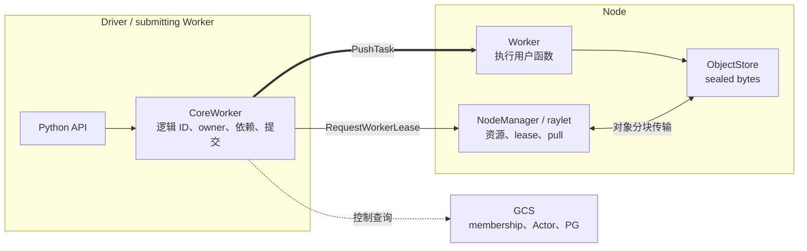

# mini-ray 与 production Ray Core 的对应关系

> 本页保留当前后端的 Same／Simplified／mini-specific 对照，不把待确认的
> owner-led 方案写成已实现。后续取舍见 [纠偏方案](correction-plan.md)，
> 当前归档与证据边界见 [handoff](handoff.md)。

本文回答两个不同的问题：

1. mini-ray 的哪个模块对应 Ray Core 的哪个职责？
2. 某项行为是 Ray 语义本身、教学化简，还是 mini-ray 为了展示故障窗口而增加的模型？

不能用“类名相似”或“功能可以运行”代替这两个判断。本文使用三个标签：

- **Ray-equivalent**：权威边界、热路径和关键语义与 Ray 相同；不表示类、线程或线协议逐行相同。
- **Ray-simplified**：保留原问题和协议形状，但缩小拓扑、策略集合、故障模型或性能工程。
- **mini-ray stronger teaching model**：为了让未知结果、重放和恢复顺序可执行、可观察，额外引入 journal、fence 或 transaction。这里的 stronger 只表示教学不变量更显式，不代表生产能力优于 Ray。

## 1. 两个平面与四个权威



四个权威不能互相替代：

| 权威 | 拥有什么 | 不拥有什么 | 分类 |
|---|---|---|---|
| CoreWorker | Task/ObjectRef 逻辑身份、owner metadata、引用生命周期、lineage、direct submission；可持有 INLINE bytes | Node 本地资源真相、Node ObjectStore 中的物理副本 | Ray-equivalent |
| GCS | 节点成员关系、Actor/PG 协调；mini 另加 publication 与 contained graph 元数据权威 | 普通 Task 放置队列和大对象字节 | 基础职责 Ray-equivalent；新增发布协议属 teaching model |
| NodeManager | 本地资源账本、Worker lease、依赖本地化、Node 级对象传输 | 用户函数、逻辑引用计数 | Ray-equivalent |
| Worker/ObjectStore | 用户代码执行；本地不可变 sealed bytes | 集群成员关系、全局调度 | Ray-equivalent / Ray-simplified |

普通 Task 的辨识度最高的主链是：

```text
f.remote()
  -> CoreWorker 构造 TaskSpec 和 pending ObjectRef
  -> dependency gate
  -> RequestWorkerLease
  -> 可选 spillback
  -> lease 返回 Worker endpoint
  -> submitting CoreWorker direct PushTask
  -> Worker 执行并发布 inline 或 stored result
  -> owner 唤醒 get/wait
```

这条链的**普通 Task 放置**不由 GCS 决定。mini-ray 的 Node 使用本地安装的不可变
集群快照做 Hybrid 决策，目标 Node 再用实时本地账本最终裁决。但图和上述简写
没有展开结果发布：当前每项普通 Task 成功都同步等待 GCS INTENT/ARM ACK，
Core adoption 又同步报告 terminal、按需 COMMIT graph、报告 adopted。Node 本地
Complete 及 lease 释放不等待 terminal ACK，不等于整个成功热路径绕过 GCS。
这一额外控制面依赖是 mini 自有协议，不应投射为 production Ray 的逐项机制。

## 2. 模块映射

下表中的 production 路径基于 Ray Core 当前源码布局。版本变化可能移动文件，但职责边界通常保持稳定。

| 领域 | mini-ray | production Ray | 保留的不变量 | 分类与边界 |
|---|---|---|---|---|
| Python API、TaskSpec、ID | `api.py`、`protocol.py`、`ids.py`、`core.py` | `python/ray/remote_function.py`、`src/ray/core_worker/core_worker.cc`、`src/ray/common/task/task_spec.h` | `.remote()` 不等待用户执行；返回前完成同步提交准备；逻辑 ID 与物理 incarnation 分离 | Ray-equivalent；API 选项大幅缩减 |
| 依赖与 direct submission | `dependency.py`、`core.py`、`worker.py` | `core_worker/task_submission/normal_task_submitter.*`、`dependency_resolver.*` | 依赖 ready 后才 lease；取得 endpoint 后由提交者直接 PushTask | Ray-equivalent |
| raylet、资源与 lease | `node.py`、`resources.py` | `raylet/node_manager.*`、`scheduling/cluster_lease_manager.*`、`local_lease_manager.*`、`hybrid_scheduling_policy.*` | feasible/available 分离；本地账本最终防超卖 | Ray-simplified：固定 1–2 Worker slot、确定性小集群 |
| GCS | `control.py`、`function_registry.py`、`output_recovery.py` | `gcs/gcs_server.*`、`gcs_node_manager.*`、`gcs_actor_manager.*`、`gcs_placement_group_manager.*` | 不决定普通 Task 放置，不持有对象 bytes | 基础控制面 Ray-simplified；同步 publication recovery 是 mini teaching model，非 Ray 原样 |
| Node 死亡传播到 Worker owner | `api.py`、`node_death_view.py`、`node.py`、`core.py` | GCS membership／raylet 通知与 CoreWorker object recovery | 先有确定死亡和安装屏障，再使 owner 移除失效位置；owner 不变 | Driver 收齐 survivor ACK 的累计证书是 mini 协议，不是新增 detector 或 Ray 原样 wire |
| 对象字节与 pull | `object_store.py`、`object_manager.py`、`node.py` | `object_manager/object_manager.*`、`pull_manager.*`、`push_manager.*`、Plasma store | immutable seal；source pin；完整目标副本才可见 | Ray-simplified：Python bytes、16 KiB chunk，无共享内存/zero-copy/spilling |
| ownership 与 nested refs | `ownership.py`、`owner_service.py`、`ref_transfer.py`、`contained_edges.py` | `core_worker/reference_counter.*`、ownership object directory | local/submitted/borrowed/contained/lineage 都是独立存活边；owner route 不等于 owner identity | Ray-simplified：直接 owner/borrower 协议，无完整 borrower tree 优化 |
| retry 与 reconstruction | `recovery.py`、`reconstruction_runtime.py`、`targeted_reconstruction.py`、`foreign_lineage*.py` | `core_worker/task_manager.*`、`object_recovery_manager.*` | TaskID/ObjectID 稳定；新 AttemptID；旧 attempt publication 被 fence | Ray-simplified：fail-stop、有限重试和小型 DAG |
| Actor | `actor_client.py`、`actor_state.py`、`actor_worker.py`、`control.py` | `gcs/actor/gcs_actor_manager.*`、`actor_task_submitter.*`、actor scheduling queue | 创建走 GCS；方法调用直达；ActorID 稳定而 generation/route 变化 | Ray-simplified：串行 Actor、有限 restart，无 named/detached/concurrency groups |
| Placement Group | `placement.py`、`placement_group_runtime.py`、`control.py`、`node.py` | `gcs_placement_group_scheduler.*`、`placement_group_resource_manager.*` | 全部 bundle commit 前不可见；participant Node 才拥有物理 reservation | Ray-simplified：bounded planner；Node loss 终止为 LOST |
| 传输与 trace | `transport.py`、`trace.py`、`trace_collector.py` | protobuf/gRPC、本地 IPC、event/task buffers | RPC identity、发送/接收因果和进程内顺序可追踪 | transport 是 Ray-simplified；显式因果 trace 是 teaching model |

## 3. Same：应从 mini-ray 带回 Ray 源码的心智模型

以下结论可以用于理解 production Ray：

- `ObjectRef` 是尚未就绪也可以传递的逻辑句柄。
- 顶层 `ObjectRef` 是执行依赖；容器中的 nested `ObjectRef` 还是数据和生命周期边。
- 普通任务先取得 raylet/NodeManager 的 Worker lease，再由提交者 CoreWorker 直达执行 Worker。
- GCS 负责控制面，而不是普通 Task 的中央转发队列。
- Node 的实时本地资源账本比集群资源摘要更权威。
- 对象逻辑 owner、物理 replica 和 replica location 是三个不同概念。
- stored object 完整 seal 前不可见。
- retry 不是 exactly-once execution：逻辑 TaskID/ObjectID 可稳定，而 AttemptID 必须变化。
- Actor 创建和 Actor method 使用不同路径：创建受 GCS 协调，稳定 route 后调用直达。
- Placement Group 必须在全部 bundle 成功前保持不可见。

## 4. Simplified：保留了问题，但不能推断生产能力

mini-ray 主动缩小了：

- 单机 loopback 上的 1–2 个逻辑 Node，而不是真实多机运维；
- 每 Node 1–2 个固定 Worker slot，而不是按 job/language/runtime-env 动态管理的 Worker pool；
- Python/cloudpickle/TCP request-reply，而不是 C++、protobuf/gRPC、本地 IPC 的组合；
- 有限标量资源与确定性 Hybrid policy，而不是完整 policy、label、affinity、公平性与背压；
- Python 内存对象存储，而不是 Plasma、shared memory、spilling、RDMA 或 RDT；
- fail-stop 与受管子进程 sentinel，而不是网络分区、复杂 failure detector 和集群规模故障；
- 串行 Actor、有限 restart/migration；
- bounded PG backtracking/matching，participant loss 后不重调度 bundle。

这些省略不会破坏教学主链，但任何吞吐、规模、HA、生产资源隔离或兼容性结论都不能由 mini-ray 推出。

### 4.1 局部性首跳不等于最终放置或 lease 复用

[`lease_policy.py`](../src/miniray/lease_policy.py) 和 Core 的 `_first_lease_route`
对应 Ray `src/ray/core_worker/lease_policy.*` 中 `LocalityAwareLeasePolicy` 的问题：
先向已知拥有最多依赖字节的 Node 请求 lease，再由该 Node 的 Hybrid/账本决定
grant 或 spillback。mini 按去重 ObjectID 的 stored bytes 累加；本 owner 只投影
匹配当前 epoch、canonical 身份的可用位置元数据，foreign 只用原 descriptor 的
单一 source。正分同分时优先 home、再按 NodeID，是明确的教学确定性规则。
这是 Ray-simplified 首跳策略，不是全套 Ray 调度策略或原实现逐项复刻。

首跳不检查 total/available，不授予资源或改写输入 source；`preferred_node_id`
指向实际首跳，requester 仍是 home，`target_node_id=None`。数据 Node 可以因资源
约束将任务 spillback 回 home；self-spillback 比较实际收件 Node，而非 requester。
PG 与已冻结的请求/收尾继续走原身份和路由，不因新的 locality hint 重新选择。
Driver 的 installed snapshot 已含地址；无快照 Worker 优先用正缓存，冷 miss 的
一次既有 `GetNodeAddress` 查询有 0.75 秒预算，成功后重查死亡/快照，失败回退 home。
缺提示不是 Node death，也不把此次地址查询变成新的强制 GCS 可用性前提。

可选 [学习路径 2A](learning-path.md#2a-optional-locality-chooses-the-first-lease-hop)
链接真实三任务实验：producer A→B、普通 consumer 首跳 B、资源 override B→A。
其实现与限定证据不证明 Worker 冷查询、完整多副本竞争或生产性能。固定 warm Worker
和函数缓存也不等于 lease 复用：每个新任务 attempt 仍有新 LeaseID，没有因此实现
生产的 scheduling-class 队列与同一 leased Worker 上的任务流水。普通成功的同步
GCS publication、global fail-fast DAG 和 phase-specific 恢复仍是原有差异/合同；
首跳局部性接通不能消除这些差异，亦不能代替完整 K0/K1 验收。

另有[Worker冷路由路径](../tests/integration/test_worker_lease_locality_path.py)：
Driver-owned source经nested handle进入A的Worker，由真实无snapshot Core
连续提交两项依赖任务到B。仅locality评分范围内的GetNodeAddress次数是
(1,0)，不能把adoption的独立查询算作cache miss，也不能宣称整个任务
只查GCS一次。成功路径验证原owner/borrower/retained lineage及存活Worker
下的GC，不替代冷查询失败、并发miss或Node-loss组合；不新增协议保证。

## 5. Stronger teaching model：不要误认为 Ray 原算法

### 5.1 显式 lease completion 与未知 RPC

mini-ray 把 `StartLease`、`CompleteLease`、cancel tombstone、exact Push replay 和 shutdown obligation 做成显式状态机。它们把“RPC 超时不等于操作未发生”展示得非常清楚。production Ray 也必须处理同一类歧义，但内部协议和状态划分并不逐项相同。

当前 Worker 的实际 `StartLease` ACK 还提供已注册 Node incarnation，随后统一
`OutputDiscoverySession` 按原始 return index 序列化每个 selected slot 一次。所有普通
Task 成功结果的 `_PreparedOutputReply` 把 bytes、source handles 和 argument import transaction
作为一张本地 custody 记录保留到其释放义务收敛。未知 ACK 只恢复这张记录，不重新
调用用户函数；这是一种显式的教学化协议组织，不是新增 Ray API 或新的调度算法。
提交者 Worker 自己执行重试时，executor 与 output owner 的 WorkerID 可以相同。
`OutputDiscoverySession` 保持 final hold/token 不变，仅将 provisional token 命名为
`provisional:<final-token>`；`PreparedContainedTransfer` 校验该精确对应关系。
不同 owner 仍使用原相同 token、不同 WorkerID 的规则；不增加 wire 字段或发布后端。

### 5.2 contained ObjectID DAG policy

`contained_cycle.py` 使用 `PREPARE/COMMIT/ABORT/RELEASE_CONTAINER` 和三色 DFS，保证教学运行时中的跨 ObjectID contained graph 无环。production Ray 的 `ReferenceCounter` 跟踪 nested refs，但不维护这张全局 GCS DAG，也不承诺同一 fail-fast policy。

[F7 控制面测试](../tests/integration/test_contained_cycle_control_path.py) 已通过真实 GCS
wire 验证两个 metadata-only proposal 的环拒绝、ABORT 与旧身份 fencing。proposal 只
绑定实际注册 publisher，不声称公共 API 构造了这两个对象或取得了 child 权限。
另一个普通任务的真实 publication/owner GC 验证 COMMIT/RELEASE；没有伪造 Complete
来清空控制状态。该证据增强此 mini 合同的验证，不增加 Ray 原算法的一比一还原程度。

### 5.3 统一 selected-output publication

mini-ray 为“用户函数已经返回，但 result/child holds/graph/lease ACK 尚未全部收敛”的窗口建立显式 Node journal、GCS recovery、owner adoption、Node-loss 和 owner-death arbitration。它适合学习：

- effect 前为什么要记录 intent；
- ACK 丢失后为什么只能重放同一 identity；
- Complete 为什么可能是 no-rollback boundary；
- Node death、outer-owner death和正常 adoption为什么必须仲裁。

当前 ordinary Task 成功已接入同一条实际后端：`OutputDiscoverySession` →
`PrepareOutputPublication` → Node journal/adapter → GCS INTENT/ARM → 本地
Complete → Core graph COMMIT 与 owner selected-output batch CAS → adopted/GC。
`output_publication.py`、`output_publication_journal.py`、`output_recovery.py` 与
`output_publication_node.py` 不再只是纯组合构件。INLINE/STORED 只决定逐槽物化，
multi-return contained 与 targeted-contained 也使用这条链。

GCS intent/snapshot/work/ACK 只含 metadata；结果 bytes 留在 Node、Worker 和 owner
的数据面 custody。成功 Complete 本地释放 lease，terminal outbox 独立重试；但
INTENT/ARM 以及 Core 的 terminal/adopted 报告仍是同步发布依赖。这是明确的
mini 自有协议和取舍，不是 production Ray publication 代码的逐项复刻。

当前 GCS 服务入口把 publication admission／恢复推进委托给同一个
`PublicationControlAdapter`，不越过接口改它的私有锁、tickets 或 cleanup
回执。服务保留 membership 与 owner-wide fence 就绪判断，adapter 保留
graph/recovery 的局部原子性与无锁 RPC 效果。这是职责封装改进，不是把
权威搬出 GCS；普通成功的同步协调和现有全局 DAG 合同均未改变。

Node loss 后，INTENT 无 ARM 可回滚，ARM 无成功 witness 是 `COMPLETION_UNKNOWN`，
已知成功是 `POSTCOMPLETE_RESOLVE`。owner 按槽决定 KEEP/DROP：收到的 INLINE
bytes 可以保留，丢失的 STORED 槽不能由 GCS metadata 制造。已知成功但丢失的槽
在清理后由显式 `get` 请求 reconstruction；未知 Complete 则在清理后预算内重试。
重建与最后引用 GC 还等待旧逻辑任务 finalizer 完成 input holds/计数收尾。
远端 promotion 成功也不证明本地 source/import release 已完成；失败 Complete
的 accepted ACK 必须晚于补偿。这些显式边界有教学价值，但不增加 Ray 原算法的
“一比一还原”分数。

一个更接近Ray既有owner模型的边界现已接通：publishing Node死亡后，已adopted
STORED结果若有grant-backed secondary，优先保留而非立刻lineage重算。Core选择
KEEP时验证owner receipt/membership/epoch，最终从当前location集合选fetch route；
canonical身份不跟随路由改写，缺失bytes仍不能由descriptor制造。该修复复用
既有统一publication，不改变其同步GCS依赖，也不代表完整Ray replica recovery。
另外，Worker物化依赖结果中的ObjectRef使用原contained hold导入，与显式Task
nested manifest的TaskHold分开；本地handle属于attempt scope，任意global逃逸
与完整生产borrower tree仍不在本切片保证内。

multi-owner pre-Push location handoff现在把执行准入与副本责任分开：
CUSTODY_ONLY/RETIRED可以拒绝consumer但明确owner的存储/删除责任；
cancel ACK不自动结束其它owner交接。一个保留的post-grant state承载全部
receipts、取消与首终态，不新增GCS publication saga。这是将既有owner/pin
问题显式化的mini协议组织，不能解释为Ray具有相同DTO或状态名。

owner 每槽只持有自身 bytes/descriptor 与 metadata membership；逐槽 GC 释放各自
contained edges，最后一个 sibling 才释放 task lineage。Targeted reconstruction
先退役旧 selected membership，只替换选定 LOST 槽，保留健康 sibling 和原始
return index；它仍执行整个函数，不能解释为只计算其中一个返回值。

Core/Node/GCS 的旧 INLINE/STORED 发布路由、journal/handlers 和旧恢复组装已移除；
GCS 使用单一 `PublicationControlAdapter`，仅保留 graph 与 output recovery。共享
capability/Node incarnation 已抽到 `publication_sources.py`，owner旧发布/退休/GC
关联也已移除。独立历史模型已归档，旧wire字段、InlineInstall facade与raw reply
edge清理也已删除；stored_publication.py仅保留共享类型的历史pickle导出。普通
成功不再投影到旧后端，同步 GCS 发布依赖仍未改变。
mixed-contained、mixed Node-loss、F1–F7 与 Worker-owned Node-loss 的限定运行记录见
[当前状态](current-status.md)。其中 pre-Complete owner death 仍有 live child owner 和
live executor，Worker-owned UNKNOWN retry 则保留原 owner 并在 survivor 执行。
F6 另验证真实 foreign late report 的 RETIRED/custody、consumer cancel、原 owner
自治 GC，以及 public targeted reconstruction 后旧 report/Drop 不删除新 epoch。
这些独立结果不代替同版本完整 gate；更宽 Node-loss/owner-death 与竞争清理矩阵
仍开放。K0/K1
目标不因接线完成而缩小，也不能将并存的旧协议算成三个必要教学模块。

### 5.4 owner-death fence

mini-ray 使用完整 Worker death proof、Node fence、typed replica observation 和 terminal tombstone，使 late seal、pull 和 cleanup replay 可判定。production Ray 使用 owner failure、reference counter 和 object recovery 的组合处理生命周期；不会按 mini-ray 的同一全节点 saga 实现。

[F4/F5](../tests/integration/test_precomplete_output_owner_death_path.py) 分别在 INTENT 后和
promotions 后使真实 outer-owner Worker 退出。其它 Node、executor 和 child owner 不死，
所以必须依赖真实 fence/release/finalize ACK，不能用失联推断清理，也不能由 Driver 接管输出。

### 5.5 Driver-certified Node death view

`node_death_view.py` 只封装已有屏障：Driver 观察受管 Node 的 sentinel，取得 GCS
death record，再收齐同一 survivor snapshot 的全部安装 ACK，才向存活 Node 发布累计
`InstalledNodeDeathView`。Node 保留匹配本地 installed snapshot 的证书；Worker 内嵌 Core
在 lazy bootstrap、既有 coordinator 轮询及 drain 时从自己的 Node 读取它。

这不是以 Worker death、RPC timeout 或缺失 snapshot 推断 Node death，也不是新的
membership authority、owner takeover 或逐 Task GCS 查询。未知发布 ACK 保留原 observer
重试；旧视图不能覆盖新 epoch/死亡历史，局部 owner 清理失败重放同一证书。
[存活 Worker owner 用例](../tests/integration/test_worker_owner_node_loss_path.py) 验证其
自动处理另一 Node 的 UNKNOWN 发布并在自己所在 Node 重试，不由 Driver 发起重建。
上述修复不消除 ordinary success 的同步 GCS 发布依赖；global DAG 和 phase-specific
恢复保证也没有因缩短教学路径而被取消。

## 6. 三层学习主线

### L1：一项普通任务为什么能异步执行

依次运行 `examples/01_task_path.py`、`02_spillback_direct_submission.py`、`03_cross_node_object_pull.py`。

读者应能回答：

1. `.remote()` 返回时什么已经发生，什么还没有发生？
2. 谁选择 Node，谁最终扣除资源？
3. 谁发送 `PushTask`，为什么 GCS 不在其中？
4. 大对象字节如何到达目标 Node，何时才可执行 consumer？

建议源码路径：`api.py → core.py submit/dependency gate → node.py lease/pull → worker.py PushTask → ownership.py`。

### L2：一个 ObjectRef 如何跨进程存活并最终回收

学习 public `put/get/wait`、Worker-side Core、nested task、blocking `get`、owner/borrower、contained refs 和 reverse GC。

读者应分别画出：

- logical `ObjectID`；
- owner metadata；
- byte-free descriptor；
- Node-local replica；
- local/submitted/borrowed/contained/lineage hold。

只有在这些边全部消失、graph/replica effect 得到精确 ACK 后，metadata 才能删除。

### L3：结果未知或进程死亡后如何收敛

依次学习：

1. lease cancel 与 exact Push replay；
2. system retry：稳定 TaskID/ObjectID、新 AttemptID；
3. lineage reconstruction 与 dependency-first replay；
4. Actor generation/route fencing；
5. Placement Group prepare/commit/abort；
6. advanced publication、Node-loss 与 owner-death arbitration。

每个故障窗口都应回答五个问题：

1. 谁是权威？
2. 已持久化的最强事实是什么？
3. 哪个请求可以原样重放？
4. 哪个旧 incarnation 必须被 fence？
5. 唯一合法终态是什么？

## 7. 返回 production Ray 的阅读路线

建议顺序：

1. `doc/source/ray-core/internals/task-lifecycle.rst`：先建立完整普通 Task 链路。
2. `src/ray/core_worker/task_submission/normal_task_submitter.*`：lease、spillback 与 direct PushTask。
3. `src/ray/raylet/scheduling/`：Cluster/Local lease manager 与 Hybrid policy。
4. `src/ray/core_worker/reference_counter.*`：local/submitted/borrowed/nested/lineage 生命周期。
5. `src/ray/object_manager/` 与 Plasma：对象位置、pull/push、pin、spilling。
6. `src/ray/core_worker/task_manager.*` 与 `object_recovery_manager.*`：retry 和 reconstruction。
7. `src/ray/gcs/actor/` 与 Placement Group scheduler：控制面长生命周期实体。

阅读时始终先找 authority 和不变量，再看线程、RPC 与数据结构；这是 mini-ray 最值得迁移回 production Ray 的方法。
